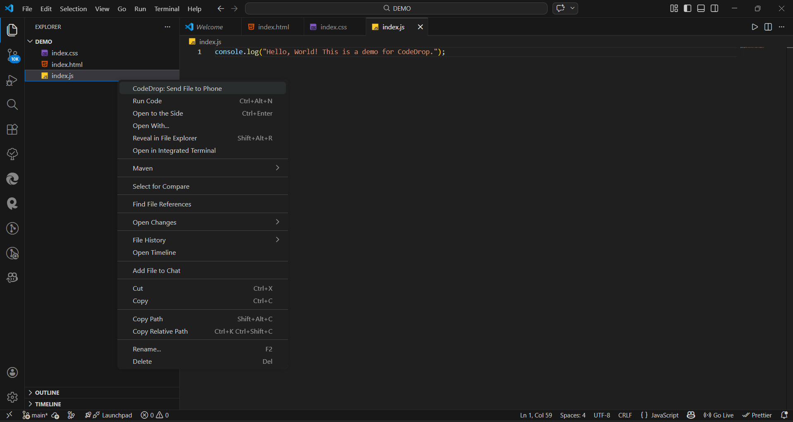
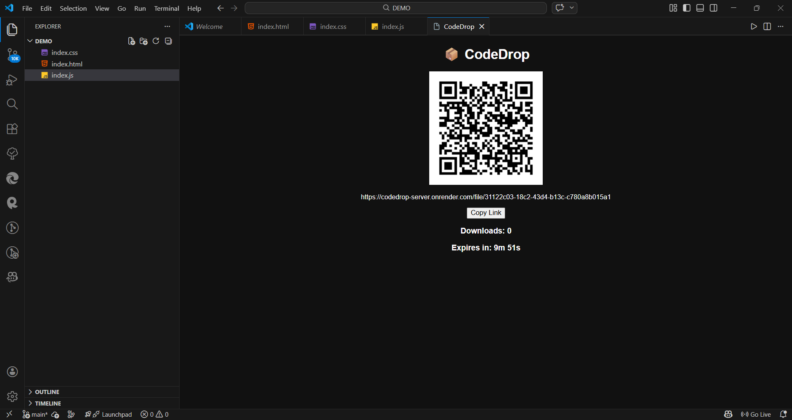
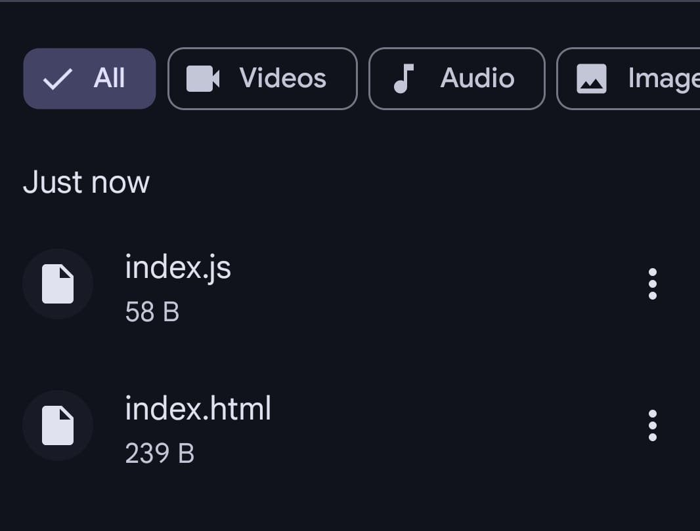

# CodeDrop

📦 **Instantly send files from VS Code to your phone using a QR code.**

CodeDrop lets you transfer files from **Visual Studio Code → your phone in seconds**  
No login. No setup. No external tools.

Just right-click → scan → download 🚀

---

## ✨ Features

- 📱 Send files directly from VS Code to your phone
- 📷 Instant QR code generation
- ⚡ No setup required (no ngrok, no accounts)
- ⏳ Files automatically expire after **10 minutes**
- 📊 Live download tracking
- 📈 Upload progress indicator
- 🔒 Secure temporary download links
- 🌐 Works over the internet
- 📄 Supports all file types (up to 10MB)

---

## 🚀 How to Use

1. Open **Visual Studio Code**
2. Right-click any file in Explorer
3. Click **CodeDrop: Send File to Phone**
4. A QR code will appear
5. Scan it using your phone
6. Download instantly

---
## 📸 Screenshots

## 🎬 Demo

## ⚙ Requirements

No setup required ✅

CodeDrop works out of the box using a secure backend service.

---

## 🔒 Security

CodeDrop is designed with safety in mind:

- 🔑 Each file has a unique secure link
- ⏳ Files auto-delete after **10 minutes**
- 📉 File size limited to **10MB**
- 📦 Files are not stored permanently
- 🚫 No public file listing

---

## ⚠ Limitations

- Maximum file size: **10MB**
- Files expire after 10 minutes
- Free backend may sleep after inactivity (first request may be slightly slow)

---

## 📦 Release Notes

### 1.1.0

🚀 Major upgrade

- Removed ngrok dependency
- Added cloud backend (no setup required)
- Upload progress indicator
- File expiry countdown
- Download tracking

### 1.0.0

Initial release

- QR-based file sharing
- Temporary secure links

---

## 👨‍💻 Author

**Anish Raj**

---

## 💡 Feedback

Found a bug or have an idea?

👉 Open an issue on GitHub  
👉 Or share feedback in reviews

Your feedback helps improve CodeDrop ❤️